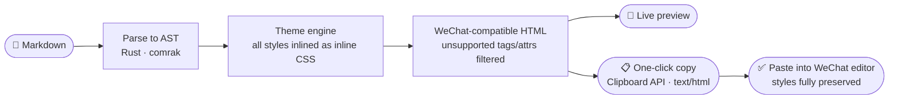

Languages: [繁體中文](README.md) | [简体中文](README.zh-CN.md) | [English](README.en.md)

<div align="center">

# DC-WeMark

### Markdown to WeChat Official Account articles, in your browser

**Write Markdown on the left, preview the styled WeChat article on the right, copy it into the WeChat editor with one click.**

<strong>Frontend only. Zero backend.</strong><br/>
The typesetting core is written in Rust and compiled to WebAssembly, running entirely in your browser;<br/>
your article never leaves your device — no server, no account, no upload.

<br/>

[](https://github.com/DylanChiang-Dev/DC-WeMark/stargazers)
[](LICENSE)
[](#architecture)
[](#architecture)
[](#status--roadmap)

</div>

---

If you write in Markdown and publish on WeChat Official Accounts, you have probably hit these walls: the WeChat editor does not accept Markdown; pasted content loses all styling; online converters upload your entire article to someone else's server.

DC-WeMark fixes exactly this gap: **write in the Markdown you already know, and get markup the WeChat editor natively understands with one click** — with the whole conversion happening inside your own browser.

## 🧭 Core Beliefs

> ### Your article belongs to you alone.

- **Frontend only, no backend.** No server logic, no database, no accounts. The deployment artifact is a bundle of static files.
- **No manuscript uploads.** Markdown parsing, formatting, and copying run locally. Remote images still contact their source hosts; the initial page load and uncached highlighting/dark-preview assets require connectivity. Full offline operation is not guaranteed.
- **No kitchen sink.** One job only: format, preview, copy. No AI writing, no account management, no publishing API.
- **One polished theme for now.** The Apple theme's palette, spacing, and layout are independently designed; we will finish and validate one theme before adding the next.

## 🗺️ How It Works



The two middle steps are the crux: the WeChat editor **only accepts rich text with inline styles** — no `<style>` tags, no classes, no `position`, and a long list of other everyday CSS. DC-WeMark's engine inlines theme styles onto every element and strips what the editor would swallow, so "paste is what you see" actually holds.

## ✨ Features

| Feature | Description | Status |
|---|---|---|
| Split-pane editor | Red-ruled stationery shell with a Simplified Chinese interface; Markdown input on the left, live WeChat-styled preview on the right (draggable divider, phone/wide toggle) | ✅ Done |
| Typesetting engine | CommonMark + GFM (tables, code blocks, task lists, footnotes) to WeChat-compatible inline-styled HTML | ✅ Done |
| One-click copy | Writes `text/html` to the clipboard with a compatibility fallback; exports explicit pixel line heights and handles overlap false positives caused by mixed inline content | ✅ Done |
| Original themes | One polished Apple theme with a custom accent color | ✅ Done |
| Typesetting settings | Three copy backgrounds, three font sizes, four font families, visual color choices, two-way scroll sync, and saved preferences | ✅ Done |
| Dark mode preview | Simulates readers' WeChat dark mode with the official open-source [mp-darkmode](https://github.com/wechatjs/mp-darkmode) algorithm; preview only, the copied HTML is unchanged. Lazy-loaded and covered by contrast regression tests | ✅ Done |
| Editing UX | Word count, import/export, Tab/Shift+Tab indentation, `Cmd/Ctrl+B/I`, file drop; native undo for editing actions and draft saving on page exit | ✅ Done |
| Safety and output notices | Unsafe URL scheme filtering, CSP security headers, local/remote image notices, deduplicated external-link footnotes, and Traditional/Simplified Chinese reference headings | ✅ Done |
| Code highlighting | Fences with a language (e.g. ` ```rust `) get token coloring; the highlighter is lazy-loaded only when an article contains code, so first load stays small (see [size notes](docs/size-baseline.md)) | ✅ Done |

New articles only need standard Markdown. The legacy `:::` container syntax still renders for backward compatibility, but has no insertion UI and will not receive new modules ([compatibility notes](docs/container-syntax.md)).

Theme development is intentionally sequential. On October 7, 2026, the user confirmed that this round's WeChat editor paste fix works. This upgrade round is closed; no additional theme is being started automatically.

### WeChat paste compatibility

- Copying converts line heights to `px` and wraps direct text mixed with inline elements to avoid content-structure false positives, without changing the preview layout.
- Code blocks wrap automatically to reduce horizontal overflow on phones; grid backgrounds carry a dark-mode compatibility marker.
- Engineering regression tests cover line heights, code/paragraph overflow, gradient backgrounds, and Chromium, WebKit, and Firefox. Dark preview is a simulation; the WeChat editor and actual phone rendering remain the final reference.
- After an update, reload the site, copy the article again, and replace the old content in the WeChat editor. Previously pasted articles are not updated automatically.

## 🚀 Getting Started

**Hosted**: [dc-wemark.pages.dev](https://dc-wemark.pages.dev), zero install.

**Self-hosted**: run `npm run build` (see Development below) and serve `web/dist/` from any static file host; no backend or container needed.

## 🧱 Architecture

| Layer | Tech | Responsibility |
|---|---|---|
| Typesetting core | Rust (compiled to WebAssembly) | Markdown parsing, theme style inlining, WeChat HTML compatibility |
| Frontend shell | Vite + vanilla TypeScript (no framework) | Split-pane editor, theme switching, clipboard write |
| Deployment | Cloudflare Pages | Static file serving, no server logic; security headers in `web/public/_headers` |

Rust + WASM instead of plain JavaScript, so the same core can later be reused in a CLI or other form factors, with type checks and tests on the core logic. First-load size and lazy-loaded assets are measured separately; CI caps first-load gzip size at 300 KB (see [size notes](docs/size-baseline.md)).

## 🛠️ Development

Requires Rust (stable), [wasm-pack](https://github.com/rustwasm/wasm-pack), and Node 20+.

```bash
git clone https://github.com/DylanChiang-Dev/DC-WeMark.git
cd DC-WeMark

cargo test               # typesetting core tests (pure Rust)

cd web
npm ci
npm run build:wasm       # build WASM into the frontend
npm run dev              # http://localhost:5173
npm run build            # produce dist/
npx playwright install --with-deps chromium webkit firefox
npm run test:e2e         # three-browser e2e, incl. CSP check on dist; build first
```

## ☁️ Deploy to Cloudflare Pages

Cloudflare Pages is connected directly to the `DylanChiang-Dev/DC-WeMark` GitHub repository:

1. `main` is the production branch; Cloudflare pulls the repository after every push.
2. Build command: `bash deploy/build-pages.sh`.
3. Output directory: `web/dist`.

Builds and deployments run entirely on Cloudflare, with no GitHub Secrets or local artifact upload required.

> The Clipboard API requires HTTPS — Cloudflare Pages provides it, and `localhost` counts as a secure context, so copy works in both.

## 📌 Status & Roadmap

Current version: **1.0.1** (live on Cloudflare Pages; the October 6–7, 2026 upgrade round is complete, with the paste fix confirmed by the user).

- [x] **0.1.0** — Engine MVP: Markdown → WeChat-compatible HTML, with 1 default theme
- [x] **0.2.0** — Split-pane editor + live preview + one-click copy
- [x] **0.3.0** — Apple theme and theme switching + custom accent
- [x] **0.4.0** — Advanced layout modules (now retained only for legacy-document compatibility)
- [x] **1.0.0** — Cloudflare Pages deploy pipeline (the Docker self-hosting option has since been removed; static hosting only)
- [x] **1.0.1 upgrade round** — Interface redesign, safety and editing improvements, lazy highlighting, WeChat dark preview, line-height and mixed-inline compatibility fixes, and three-browser regression tests

Semantic three-part versioning; this round stays on `1.0.1`, with no new release or tag. A possible future task is shrinking the lazy-loaded highlighter; it is not unfinished work in this round and requires a separate kickoff.

## ⭐ Star History

If this project helps you, star it — help more writers still hand-tweaking WeChat layouts find it.

[](https://star-history.com/#DylanChiang-Dev/DC-WeMark&Date)

## 📄 License & Acknowledgements

**MIT License** (copyright Dylan Chiang) — free to use, modify, and redistribute (commercial use included), as long as the copyright notice is kept.

"Markdown to WeChat typesetting" is a space with many pioneers; credit where it is due:

- [**md2wechat-skill**](https://github.com/geekjourneyx/md2wechat-skill) — the primary functional and visual benchmark; the Apple sample uses a warm-white rounded article, bright-blue emphasis, softly shadowed images, and blue-purple-pink gradient section headings (Source Available License)
- [**doocs/md**](https://github.com/doocs/md) — a secondary web-editor form-factor reference (MIT)
- [**markdown-nice**](https://github.com/mdnice/markdown-nice) — a secondary themed-typesetting reference (GPL-3.0)

> Only public feature boundaries and problem framing were referenced. **All code, theme styles, and copy are independently original**; no source code or styles from the projects above were copied.
