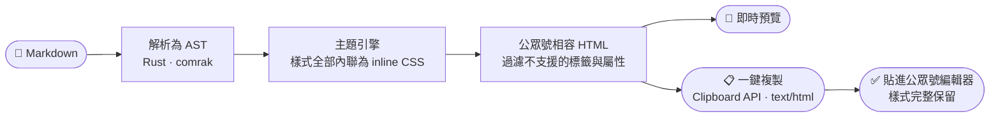

語言：[繁體中文](README.md) | [简体中文](README.zh-CN.md) | [English](README.en.md)

<div align="center">

# DC-WeMark

### 在瀏覽器裡把 Markdown 排版成微信公眾號文章

**左邊寫 Markdown，右邊即時預覽公眾號效果，一鍵複製、貼進公眾號編輯器就能發。**

<strong>純前端，零後端。</strong><br/>
排版核心用 Rust 寫、編譯成 WebAssembly 在你的瀏覽器裡跑；<br/>
文章從頭到尾不離開你的裝置，沒有伺服器、沒有帳號、沒有上傳。

*Write Markdown, preview it as a styled WeChat Official Account article, and copy it into the WeChat editor with one click — entirely in your browser.*

<br/>

[](https://github.com/DylanChiang-Dev/DC-WeMark/stargazers)
[](LICENSE)
[](#技術架構)
[](#技術架構)
[](#專案狀態與路線圖)

</div>

---

如果你用 Markdown 寫作、在微信公眾號發文，你大概踩過這些坑：公眾號編輯器不吃 Markdown；貼上後樣式全掉；線上轉換工具要把整篇文章傳到別人的伺服器上。

DC-WeMark 要解決的就是這一段：**寫作用你熟悉的 Markdown，發布時一鍵得到公眾號編輯器直接認得的排版**——而且整個轉換在你自己的瀏覽器裡完成。

## 🧭 核心信念

> ### 你的文章只屬於你。

- **純前端，無後端。** 沒有伺服器邏輯、沒有資料庫、沒有帳號系統。部署產物就是一包靜態檔案。
- **內容不出裝置。** 從輸入 Markdown 到複製 HTML，每一步都在瀏覽器本地執行；斷網也能用。
- **不做全家桶。** 只做一件事：排版、預覽、複製。不接 AI 寫作、不管你的公眾號帳號、不碰發布 API。
- **主題全部原創。** 每一套主題的配色、字距、版式都是本專案自己設計的。

## 🗺️ 工作原理



關鍵在中間兩步：微信公眾號編輯器**只接受 inline style 的富文字**，不支援 `<style>` 標籤、class、`position` 等一大批常規寫法。DC-WeMark 的排版引擎把主題樣式逐一內聯到每個元素上，並過濾掉編輯器會吞掉的東西，讓「貼上即所見」真正成立。

## ✨ 功能

| 功能 | 說明 | 狀態 |
|---|---|---|
| 雙欄編輯器 | 左側 Markdown 輸入，右側公眾號樣式即時預覽（含拖分隔線、手機/寬版切換） | ✅ 完成 |
| 排版引擎 | CommonMark + GFM（表格、程式碼區塊、任務清單），輸出公眾號相容的 inline-styled HTML | ✅ 完成 |
| 一鍵複製 | 以 `text/html` 寫入剪貼簿（含 Safari 相容路徑），貼進公眾號編輯器保留全部樣式 | ✅ 完成 |
| 原創主題 | 5 套原創主題可切換（晴川／墨白／晚報／松石／暖陽）＋ 自訂強調色 | ✅ 完成 |
| 排版模組 | `:::` 容器語法：提示框、卡片、金句、時間軸等（見 [語法說明](docs/container-syntax.md)） | ✅ 完成 |
| 編輯體驗 | 字數統計、`.md` 匯入／匯出、Tab 縮排、`Cmd/Ctrl+B/I`、拖入檔案、本地草稿 | ✅ 完成 |
| 程式碼高亮 | 語法 token 上色（可選 feature；預設關以控體積，見 [體積說明](docs/size-baseline.md)） | 🚧 opt-in |

## 🚀 快速開始

**線上版**：託管於 Cloudflare Pages，打開即用、無需安裝（部署見下方）。

**自架（Docker，一行啟動）**：

```bash
docker build -f deploy/Dockerfile -t dc-wemark .
docker run -p 8080:80 dc-wemark
# 打開 http://localhost:8080
```

## 🧱 技術架構

| 層 | 技術 | 職責 |
|---|---|---|
| 排版核心 | Rust（編譯至 WebAssembly） | Markdown 解析、主題樣式內聯、公眾號 HTML 相容處理 |
| 前端殼 | Vite + 原生 TypeScript（零框架） | 雙欄編輯器、主題切換、剪貼簿寫入 |
| 部署 | Cloudflare Pages（主）／Docker + nginx（自架） | 純靜態檔案分發，無伺服器邏輯 |

選 Rust + WASM 而不是純 JavaScript，是為了同一個排版核心將來可以直接複用到 CLI 或其他形態，且核心邏輯有完整的型別與測試保障。整站 gzip 約 130KB。

## 🛠️ 本地開發

需要 Rust（stable）、[wasm-pack](https://github.com/rustwasm/wasm-pack) 與 Node 20+。

```bash
git clone https://github.com/DylanChiang-Dev/DC-WeMark.git
cd DC-WeMark

# 1) 排版核心測試（純 Rust）
cargo test

# 2) 建置 WASM 到前端
cd web
npm install
npm run build:wasm

# 3) 啟動開發伺服器
npm run dev            # http://localhost:5173

# 其他
npm run build          # 產出 dist/（tsc 型別檢查 + vite build）
npm run test:e2e       # Playwright e2e（chromium + webkit）
```

## ☁️ 部署到 Cloudflare Pages

1. 在 Cloudflare Pages 建立一個 Direct Upload 專案，命名 `dc-wemark`。
2. 在 GitHub repo Secrets 設定 `CLOUDFLARE_API_TOKEN`（具 Pages 編輯權限）與 `CLOUDFLARE_ACCOUNT_ID`。
3. push 到 `main` 會觸發 [`deploy.yml`](.github/workflows/deploy.yml)：建置 WASM + 前端後 `wrangler pages deploy`。

> Clipboard API 需要 HTTPS——Cloudflare Pages 自帶 HTTPS，本地 `localhost` 也算安全內容，皆可正常複製。

## 📌 專案狀態與路線圖

目前版本：**1.0.0**（功能完成、自架就緒；線上版待接入 Cloudflare 帳號部署）。

- [x] **0.1.0** — 排版引擎 MVP：Markdown → 公眾號相容 HTML，含 1 套預設主題
- [x] **0.2.0** — 雙欄編輯器 + 即時預覽 + 一鍵複製
- [x] **0.3.0** — 多主題系統與主題切換 + 自訂強調色
- [x] **0.4.0** — 進階排版模組（提示框、卡片、金句、時間軸）
- [x] **1.0.0** — Docker 自架方案 + Cloudflare Pages 部署流程

版本採三段式語意化版號，每個版本打 git tag。後續：富程式碼高亮的體積最佳化（延遲載入或 vendored 語法檔）。

## ⭐ Star 趨勢

如果這個專案幫到你，按顆星——讓更多還在手動調公眾號排版的寫作者看到它。

[](https://star-history.com/#DylanChiang-Dev/DC-WeMark&Date)

## 📄 授權與致謝

**MIT License**（版權人 Dylan Chiang 蔣濤）——可自由使用、修改、再發布（含商用），保留版權聲明即可。

「Markdown 轉公眾號排版」是一個有眾多先行者的領域，特此致謝其中的開拓者：

- [**doocs/md**](https://github.com/doocs/md) —— 網頁版微信 Markdown 編輯器的形態先例（MIT）
- [**markdown-nice**](https://github.com/mdnice/markdown-nice) —— 主題化公眾號排版的理念方向（GPL-3.0）
- [**md2wechat-skill**](https://github.com/geekjourneyx/md2wechat-skill) —— 排版模組擴充語法的理念啟發（Source Available License）

> 僅借鑑功能理念與問題意識，**程式碼、主題樣式、文案全部獨立原創**——零程式碼借用、零樣式複製。本專案為 clean-room 獨立實現，開發過程不參考上述任何專案的原始碼。
