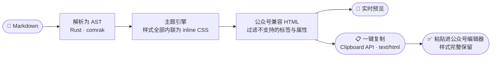

语言：[繁體中文](README.md) | [简体中文](README.zh-CN.md) | [English](README.en.md)

<div align="center">

# DC-WeMark

### 在浏览器里把 Markdown 排版成微信公众号文章

**左边写 Markdown，右边实时预览公众号效果，一键复制、粘贴进公众号编辑器就能发。**

<strong>纯前端，零后端。</strong><br/>
排版核心用 Rust 编写、编译成 WebAssembly 在你的浏览器里运行；<br/>
文章从头到尾不离开你的设备，没有服务器、没有账号、没有上传。

*Write Markdown, preview it as a styled WeChat Official Account article, and copy it into the WeChat editor with one click — entirely in your browser.*

<br/>

[](https://github.com/DylanChiang-Dev/DC-WeMark/stargazers)
[](LICENSE)
[](#技术架构)
[](#技术架构)
[](#项目状态与路线图)

</div>

---

如果你用 Markdown 写作、在微信公众号发文，你大概踩过这些坑：公众号编辑器不吃 Markdown；粘贴后样式全掉；在线转换工具要把整篇文章传到别人的服务器上。

DC-WeMark 要解决的就是这一段：**写作用你熟悉的 Markdown，发布时一键得到公众号编辑器直接认得的排版**——而且整个转换在你自己的浏览器里完成。

## 🧭 核心信念

> ### 你的文章只属于你。

- **纯前端，无后端。** 没有服务器逻辑、没有数据库、没有账号系统。部署产物就是一包静态文件。
- **内容不出设备。** 从输入 Markdown 到复制 HTML，每一步都在浏览器本地执行；断网也能用。
- **不做全家桶。** 只做一件事：排版、预览、复制。不接 AI 写作、不管你的公众号账号、不碰发布 API。
- **主题全部原创。** 每一套主题的配色、字距、版式都是本项目自己设计的。

## 🗺️ 工作原理



关键在中间两步：微信公众号编辑器**只接受 inline style 的富文本**，不支持 `<style>` 标签、class、`position` 等一大批常规写法。DC-WeMark 的排版引擎把主题样式逐一内联到每个元素上，并过滤掉编辑器会吞掉的东西，让"粘贴即所见"真正成立。

## ✨ 功能

| 功能 | 说明 | 状态 |
|---|---|---|
| 双栏编辑器 | 左侧 Markdown 输入，右侧公众号样式实时预览 | 🚧 开发中 |
| 排版引擎 | CommonMark + GFM（表格、代码块、任务清单），输出公众号兼容的 inline-styled HTML | 🚧 开发中 |
| 一键复制 | 以 `text/html` 写入剪贴板，粘贴进公众号编辑器保留全部样式 | 🚧 开发中 |
| 原创主题 | 多套排版主题可切换，覆盖不同文章调性 | ⬜ 规划中 |
| 排版模块 | 卡片、引言、时间轴等高级版式的扩展语法 | ⬜ 规划中 |
| 代码高亮 | 适配公众号限制的语法高亮方案 | ⬜ 规划中 |
| 离线可用 | 静态站 + WASM，加载一次后断网照常工作 | ⬜ 规划中 |

## 🚀 快速开始

> 项目处于早期开发阶段，尚未发布可用版本。首个可用版本上线后，这一节会变成一句话：**打开网页，开始写。**

届时提供两种使用方式：

1. **在线版**：托管于 Cloudflare Pages，打开即用，无需安装。
2. **自部署**：`docker run` 一行命令，在你自己的服务器或 NAS 上跑同一套静态站。

## 🧱 技术架构

| 层 | 技术 | 职责 |
|---|---|---|
| 排版核心 | Rust（编译至 WebAssembly） | Markdown 解析、主题样式内联、公众号 HTML 兼容处理 |
| 前端壳 | 轻量 Web 前端 | 双栏编辑器、主题切换、剪贴板写入 |
| 部署 | Cloudflare Pages（主）／Docker + nginx（自部署） | 纯静态文件分发，无服务器逻辑 |

选 Rust + WASM 而不是纯 JavaScript，是为了同一个排版核心将来可以直接复用到 CLI 或其他形态，且核心逻辑有完整的类型与测试保障。

## 🛠️ 本地开发

```bash
git clone https://github.com/DylanChiang-Dev/DC-WeMark.git
cd DC-WeMark
```

构建工具链（Rust + wasm-pack + 前端）的完整说明将随首个可运行版本补充。

## 📌 项目状态与路线图

当前版本：**0.0.1 之前**（仓库初建，核心开发中）。

- [ ] **0.1.0** — 排版引擎 MVP：Markdown → 公众号兼容 HTML，含 1 套默认主题
- [ ] **0.2.0** — 双栏编辑器 + 实时预览 + 一键复制
- [ ] **0.3.0** — 多主题系统与主题切换
- [ ] **0.4.0** — 高级排版模块（卡片、引言、时间轴等）
- [ ] **1.0.0** — 在线版正式上线（Cloudflare Pages）+ Docker 自部署方案

版本采用三段式语义化版本号，每个版本打 git tag。

## ⭐ Star 趋势

如果这个项目帮到你，点颗星——让更多还在手动调公众号排版的写作者看到它。

[](https://star-history.com/#DylanChiang-Dev/DC-WeMark&Date)

## 📄 授权与致谢

**MIT License**（版权人 Dylan Chiang 蒋涛）——可自由使用、修改、再发布（含商用），保留版权声明即可。

"Markdown 转公众号排版"是一个有众多先行者的领域，特此致谢其中的开拓者：

- [**doocs/md**](https://github.com/doocs/md) —— 网页版微信 Markdown 编辑器的形态先例（MIT）
- [**markdown-nice**](https://github.com/mdnice/markdown-nice) —— 主题化公众号排版的理念方向（GPL-3.0）
- [**md2wechat-skill**](https://github.com/geekjourneyx/md2wechat-skill) —— 排版模块扩展语法的理念启发（Source Available License）

> 仅借鉴功能理念与问题意识，**代码、主题样式、文案全部独立原创**——零代码借用、零样式复制。本项目为 clean-room 独立实现，开发过程不参考上述任何项目的源代码。
